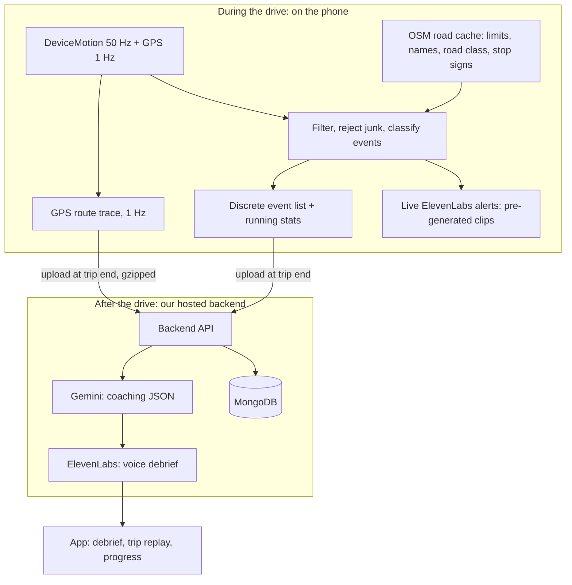

# LLM Driving Coach: Master Project Doc

Working title: TBD
Built for: a weekend hackathon (student driver scope)
Merged from: the original project context doc, Julio's "Driving Event Detection," and the "Map/location integration strategy" doc, with team decisions applied

All items below are decided unless tagged **[Proposed]** (a sensible default nobody has objected to) or listed under "Flags" in section 18.

---

## 1. Product

### One-liner

Life360 tells your parents where you are. We teach you how to drive.

A phone-only app for student drivers that detects driving mistakes in real time, gives instant voice alerts for dangerous ones, and gives an AI voice coaching debrief after every trip, focused on the skills new drivers are graded on in their road test.

### Problem

New drivers are the highest-risk group on the road. Existing apps mostly monitor them for parents or insurers. They report what went wrong but do not coach the driver on how to improve specific skills.

### Target user

- **Hackathon scope:** the student driver only.
- **Future:** parent and instructor views.

### Core idea: fusion

The sensor detects the event, map data interprets it, and the LLM explains it. A hard brake on a highway is different from the same brake approaching a stop sign; speeding on a 25 mph residential street is different from speeding on a highway.

### Competition and differentiation

| App | What it does | Gap we fill |
|---|---|---|
| Life360 | Family location, crash detection | Monitoring, not coaching |
| ZenRoad (Damoov) | Free telematics: braking, acceleration, cornering, speeding, phone use, 0 to 100 trip score | Score and event list, no conversational coaching |
| OtoZen | Teen driver app: speeding and phone alerts, crash detection | Parent alerts, not skill coaching |
| RoadReady | Permit phase app, added telematics scoring and coaching in 2026 | Closest competitor; we go deeper on maneuver-level skills and voice coaching |
| DriveScribe | Trip scores, rewards points | Rewards, little coaching |
| LifeSaver | Locks the phone while driving | Lock only, no learning loop |
| DriveSmart | Markets "AI-powered insights" | Do not claim "first AI driving app" |
| Insurance apps (Snapshot, Drive Safe & Save) | Score driving to set prices | Built to price you, not teach you |

Differentiators:

1. Maneuver-level grading with road context: rolling stops at real stop signs, speeding against the actual street limit.
2. Live ElevenLabs voice alerts for dangerous moments, plus a conversational Gemini coach after the trip.
3. Recurring-spot detection: "you brake hard at this corner often" (MongoDB geospatial queries across trips).
4. Road test framing: a "test readiness" view tied to what examiners grade.
5. Phone use handled as coaching: optional lock, live warnings, and a score penalty.

---

## 2. Tech stack

| Layer | Choice |
|---|---|
| Database | MongoDB (Atlas) |
| LLM | Gemini |
| Voice | ElevenLabs |
| Sensors | Phone only |
| App | React Native with Expo (`expo-sensors`, `expo-location`, `expo-keep-awake`) |
| Backend | Our own server, hosted and deployed (framework and host TBD, e.g. Node.js or FastAPI) |
| Map display | Google Maps via `react-native-maps` |
| Street View | After a trip only (section 12): Street View Static API + metadata endpoint on the server, and the Maps JavaScript API (Street View panorama only) on a page our backend serves, shown in `react-native-webview` |
| Road data | OpenStreetMap via the Overpass API: street names, speed limits (`maxspeed`), road class (`highway`), stop signs (`highway=stop`) |

Not used: Google Roads speed limits (needs an Asset Tracking license), Valhalla, TomTom, HERE, Mapbox, MapLibre. See section 19 for when those might come back.

---

## 3. Architecture



Key rules:

- **Classify in real time; keep only the GPS trace as raw data.** Events are computed live and stored as discrete documents. Motion samples (50 Hz) live in short ring buffers and are discarded once classified; they are never uploaded or stored. The GPS trace (1 Hz) is kept for the whole trip and uploaded once at the end, only for route tracing in the after-trip report and replay.
- **Road data is fetched ahead, not per GPS update.** The app queries Overpass for the area around the car and caches it (section 8).
- **Gemini gets a compact JSON summary** of events and stats, never sensor data.
- **Live alerts use pre-generated audio** so they play instantly, even offline.

---

## 4. Trip lifecycle and driving mode

- **Start:** manual. The student taps "Start drive."
- **Driving mode lock (optional toggle):** a full-screen in-app lock screen, on by default [Proposed], that the student can turn off in settings. Emergency calls, navigation, and music always stay available.
- **Phone use while driving:** whether the lock is on or off, using the phone while moving triggers a voice warning and counts against the score (section 7).
- **Passenger option:** "I'm a passenger" skips scoring for that trip [Proposed].
- **Keep the app in front:** `expo-keep-awake` keeps the screen on and sensor sampling at full rate. Background sensor access on iOS is not worth fighting this weekend.
- **End:** manual, only allowed after the car has been stopped for 30+ seconds (prevents ending at a red light). After the trip ends, the app walks through the post-trip screens (section 12) and the voice debrief plays on the coaching screen, the last step.
- **Offline:** events and the GPS trace are queued on the phone and uploaded when the trip ends and there is a connection.

---

## 5. Sensors and APIs

| API | What it gives | Use |
|---|---|---|
| `expo-sensors` `DeviceMotion` | `acceleration` (gravity removed), `accelerationIncludingGravity`, rotation rate, in one stream | Main detector input |
| `expo-location` `watchPositionAsync` | Position, speed, heading, accuracy at about 1 Hz | Speeding, stop signs, event pins, sign of acceleration |
| React Native `AppState` + touch handlers | Whether the app left the foreground; screen touches | Phone use detection |

- Set motion to about 50 Hz with `setUpdateInterval(20)`.
- **Check units first.** Log a phone lying still: gravity should read about 1 on `Accelerometer` (g) and about 9.8 on `accelerationIncludingGravity` (m/s²). Check rotation-rate units in the Expo docs.

---

## 6. Handling phone orientation

A mount is recommended, since a sliding phone creates fake events. Build level 1 first; level 2 only if time allows.

**Level 1: no calibration**

- Up = gravity vector ĝ.
- Yaw rate = rotation rate · ĝ (how fast the car turns, regardless of phone orientation).
- Lateral acceleration = GPS speed (m/s) × yaw rate (rad/s).
- Horizontal acceleration h = a − (a·ĝ)ĝ. Its size is the road force; the sign of the GPS speed change says braking vs accelerating.

**Level 2: learn the forward axis**

- When GPS speed is clearly changing (|dv/dt| > 1 m/s²) and yaw rate is near zero, add h × sign(dv/dt) to a running average.
- The normalized average is the forward axis f̂; sideways is ĝ × f̂.
- Then h·f̂ is longitudinal and h·(ĝ × f̂) is lateral acceleration, both at 50 Hz.
- Reset when the gyroscope shows the phone was picked up.

---

## 7. Events, thresholds, and live alerts

### Detection pipeline

Rules, not machine learning.

1. **Collect:** motion at 50 Hz and GPS at 1 Hz into short ring buffers for detection. Every GPS fix is also appended to the trip's route trace.
2. **Filter:** exponential moving average, α ≈ 0.2 at 50 Hz (about a 2 Hz cutoff).
3. **Reject junk:** pause detection when rotation off the gravity axis exceeds about 60°/s (phone picked up) or raw acceleration exceeds 1.5 g (dropped phone or pothole).
4. **Classify:** each rule is a small state machine with a start threshold, a lower release threshold, and a minimum duration. Merge same-type events within 3 s.
5. **Record the event, drop the samples:** type, tier, peak, duration, speed, limit, street, timestamp, and the GPS fix nearest the peak.
6. **Upload at trip end:** events plus running stats go to the backend.

```ts
// Level 1 detector core (sketch)
function onMotion(s: { acc: Vec3; grav: Vec3; rot: Vec3; t: number }, gps: Fix) {
  const up = norm(s.grav);
  const yaw = dot(s.rot, up);                          // rad/s, car turning rate
  const h = sub(s.acc, scale(up, dot(s.acc, up)));     // horizontal accel
  lat = ema(lat, gps.speed * yaw);                     // m/s²
  horiz = ema(horiz, len(h));
  const lon = Math.sign(gps.dvdt) * horiz;             // + accelerating, − braking

  brake.update(-lon, s.t);       // fires at 3.5 for ≥ 0.4 s, releases at 1.5
  turn.update(Math.abs(lat), s.t);
  swerve.update(lat, s.t);       // looks for +2 then −2 within 2 s
}
```

### Thresholds

Values are m/s² after the ~2 Hz filter (1 g = 9.81 m/s²). Starting values from common telematics practice (Progressive Snapshot counts a hard brake at about 3.1 m/s²); tune on our own test drives.

| Event | Signal | Coach tier (debrief) | Harsh tier (live alert) | Must also hold |
|---|---|---|---|---|
| Hard braking | Longitudinal deceleration | ≥ 3.5 | ≥ 4.5 | ≥ 0.4 s; GPS speed dropping |
| Hard acceleration | Longitudinal acceleration | ≥ 3.0 | ≥ 4.0 (debrief only) | ≥ 0.4 s; GPS speed rising |
| Rough turn | Lateral acceleration | ≥ 3.0 | ≥ 4.0 | ≥ 0.5 s; heading change > 30° |
| Swerve | Lateral sign flip | ±2.5 | ±4.0 | + then − within 2 s; net heading change < 15°; speed > 25 km/h |
| Speeding | GPS speed vs limit | +5 mph | +15 mph, posted limit only | ≥ 5 s; GPS accuracy < 20 m |
| Rolling stop | Min speed passing a stop sign | > about 4 mph | none (debrief only) | See section 8 |
| Phone use | Touch or app leaving foreground while moving | always logged | always warned | Speed > 10 km/h |

A normal lane change usually stays under 1.5 m/s² lateral, which is why the swerve rule needs ±2.5 and a quick sign flip.

**Not in scope:** turn signal detection.

### Live ElevenLabs alerts

Live voice for:

- Harsh braking
- Rough turns
- Swerving
- Speeding, **only against a posted (high-confidence) limit**
- Phone use while moving

Rules:

- Voice only, never visual.
- Pre-generated ElevenLabs clips bundled in the app for zero latency, e.g. "Easy on the brakes," "Slow down, the limit here is 30" (a small set per common limit), "Smooth that turn," "Keep it steady," "Eyes on the road, put the phone down."
- Cooldown of about 60 s between alerts of the same type [Proposed]. Phone use warnings are exempt from the cooldown.
- Everything else (coach tier, hard acceleration, rolling stops, speeding against inferred limits) goes to the debrief only.

### Phone use detection

- **Lock on:** any touch on the lock screen other than emergency or navigation while moving counts as phone use.
- **Lock off:** a touch in the app, or the app leaving the foreground (`AppState` becomes background) while moving, counts as phone use.
- Each phone use event plays a warning and applies a score penalty. Log duration when the app was away.

### Scoring [Proposed]

Score computed in code, not by Gemini, so it is consistent and explainable: start at 100 and subtract weighted penalties per event, normalized per 10 miles. Harsh tier weighs more than coach tier. Phone use carries the heaviest penalty. Gemini receives the score and explains it.

---

## 8. Road data from OpenStreetMap

### Overpass road cache

- At trip start, and whenever the car nears the edge of the cached area, query Overpass for ways and stop signs within about 1 to 2 km of the car.
- Per way, keep: geometry, `name`, `highway` (road class), `maxspeed` if tagged, and `oneway`.
- Per stop sign node (`highway=stop`), keep: location and `direction` if tagged.
- Match each GPS fix to the nearest way, using heading to break ties at intersections and parallel roads.
- This one cache gives street names for event pins, speed limits for speeding, and stop signs for rolling stops, with no per-update API calls.

### Speed limits

| Source | Confidence | Used for |
|---|---|---|
| OSM `maxspeed` tag on the matched way | **Posted** | Live alerts and scoring |
| Road class default (residential 25, primary 45, motorway 65 mph; adjust as needed) | **Inferred** | Scoring and debrief only, never live alerts |
| No match | Unknown | No speeding check |

- Every speeding event stores `limitConfidence`, and Gemini is told when a limit was estimated so it can say so.
- US OSM coverage is weakest on residential streets. Check the demo route in advance and pick roads with tagged limits.

### Rolling stops

- A stop sign is "ours" when the car's path passes within about 15 m of the node and, if `direction` is tagged, the car's heading matches it.
- If the minimum speed within that window stays above about 4 mph, log a rolling stop.
- Known risk: OSM stop signs often lack direction, so signs for cross traffic can cause false positives. Keep rolling stops debrief-only and tune the radius on real drives.

### Display

- Google Maps via `react-native-maps` draws the route polyline and event markers.
- Show "© OpenStreetMap contributors" wherever OSM data (street names, limits) is displayed.

---

## 9. Data model (MongoDB)

Stored: trip summaries, discrete events, and one GPS route trace per trip. Motion sensor data is never stored.

```js
users:  { _id, name, createdAt }

trips:  { _id, userId, startedAt, endedAt, distanceMi, passenger /* bool */,
          lockEnabled /* bool */,
          routePreview /* simplified GeoJSON LineString for lists and thumbnails */,
          counts: { brake, accel, turn, swerve, speeding, rollingStop, phoneUse },
          stats: { eventsPer10Mi, pctTimeSpeeding, phoneUseSeconds },
          score, coach /* Gemini JSON */, coachAudioUrl,
          streetView /* { eventId, heading, caption } or null; never the image (section 12) */ }

events: { _id, tripId, userId, type, tier /* coach | harsh */, peak, durationS,
          speedMph, limitMph, limitConfidence /* posted | inferred | unknown */,
          street, roadClass, alerted /* bool */,
          at, location /* GeoJSON Point, 2dsphere index */ }
```

The 2dsphere index on `events.location` powers recurring-spot detection across trips.

### Route traces (report and replay)

The usual pain with raw data in a database comes from storing one document per sample: huge collections, heavy indexes, and slow reads. We avoid that entirely:

- **GPS only, no motion data.** Route tracing and replay only need position, speed, and time.
- **One document per trip, columnar arrays.** Written once at trip end, read once when the report opens, never queried sample by sample.
- **Small.** A 30-minute drive at 1 Hz is about 1,800 fixes, roughly 100 KB as JSON and much less gzipped, far below MongoDB's 16 MB document limit. Very long trips can be split into chunks by time if ever needed.
- **Separate from `trips`.** Trip lists and progress queries stay fast because they never load the trace.

```js
traces: { _id, tripId /* unique index */, userId, startedAt, hz: 1,
          t:        [0, 1, 2, ...],       // seconds since trip start
          lat:      [...],
          lon:      [...],
          speedMps: [...],
          heading:  [...],
          accuracyM:[...] }
```

The phone gzips the trace and uploads it with the trip; the backend stores it as a normal document. Events already carry their own timestamps, so they line up with the trace by time.

### Replay

- The app loads the trip, its events, and its trace.
- Google Maps draws the full route; a car marker animates along it.
- Event pins pop in at their timestamps, with the matching alert or coaching note.
- A timeline under the map shows speed vs the speed limit, with a scrub bar and 1x, 4x, and 10x playback.

Replay shows what happened; it does not re-run detection, since motion data is not kept. For tuning thresholds during development, a dev-only recorder can save motion data to a local file on the tester's phone (never uploaded).

---

## 10. LLM coaching with Gemini

Principle: Gemini does not do the math. Code classifies events and computes the score. Gemini finds patterns, prioritizes, and explains.

### Input: compact trip summary

```json
{
  "trip": { "duration_min": 22, "distance_mi": 9.4, "score": 71 },
  "events": [
    { "type": "hard_brake", "tier": "harsh", "peak": 3.8, "speed_mph": 34, "street": "SW 8th St", "alerted": true },
    { "type": "rolling_stop", "tier": "coach", "min_speed_mph": 5, "street": "SW 107th Ave" },
    { "type": "speeding", "tier": "coach", "over_mph": 7, "limit_mph": 25, "limit_confidence": "inferred", "street": "SW 24th Ter" },
    { "type": "phone_use", "duration_s": 12, "speed_mph": 28 }
  ],
  "stats": { "events_per_10mi": 3.2, "pct_time_speeding": 3, "phone_use_seconds": 12 },
  "history": {
    "last_5_scores": [61, 64, 70, 68, 73],
    "recurring_spots": [{ "type": "hard_brake", "street": "SW 8th St", "count": 4 }]
  }
}
```

### Output: structured coaching (JSON mode)

Use `response_mime_type: application/json` with a response schema:

```json
{
  "strengths": ["Smooth turns", "Steady highway speed"],
  "focus_areas": [
    { "skill": "Braking early", "why": "4 hard brakes approaching the same SW 8th St intersection", "tip": "Start easing off when the light first comes into view" }
  ],
  "debrief_script": "Solid drive, 71 today...",
  "street_view_caption": "This is the stop sign on Oak St. You slowed to 5 mph here; come to a full stop behind the white line.",
  "chat": [
    "Hey, nice drive! Let's talk it through.",
    "Your turns were really smooth today. That's exactly what examiners look for.",
    "Now, 8th Street. That's four hard brakes at the same light..."
  ]
}
```

### Prompt guidelines

- Role: a patient driving instructor coaching a student preparing for their road test.
- Provide event definitions and thresholds so the model does not invent interpretations.
- Only reference events present in the data. Never make up incidents.
- When a speeding event used an inferred limit, say the limit was estimated.
- Treat phone use seriously but without lecturing.
- Pick the 1 to 2 most important focus areas.
- Compare with history; call out improvement and recurring spots.
- Keep `debrief_script` (a short written summary) under about 60 words.
- `chat` is the coaching conversation: 6 to 10 short messages, about 160 words in total, spoken aloud. Sound like a real, personable coach talking to the student after the drive, not a report: warm, conversational, specific. Same fact rules as above.
- `street_view_caption`: for the one event picked for Street View (`street_view_event` in the input), one or two sentences under about 30 words that name the place and give one concrete tip. Gemini cannot see the image, so it must describe only the event data, never what the picture shows (signs, lanes, buildings). Null when no event was picked. The chat may mention it briefly ("I pulled up the spot on Oak St for you") only when a callout exists.
- Tone: encouraging, specific, plain language.

### Ask the coach (stretch)

The student asks "Am I getting better at stops?" The backend pulls relevant trips and events from MongoDB, and Gemini answers from that data.

---

## 11. Voice with ElevenLabs

- **Live alerts:** pre-generated clips bundled in the app (section 7).
- **Debrief:** the backend sends Gemini's `chat` messages to ElevenLabs as one track (with character timings) and returns the audio URL; `chat_audio_starts_s` records when each message starts so the app shows each chat bubble as the coach says it. About 900 ElevenLabs characters per trip.
- Check whether ElevenLabs runs a sponsor prize track.

---

## 12. App screens

1. Start drive (lock toggle, passenger option)
2. Driving mode (lock screen or minimal driving screen; emergency and navigation access)
3. Post-trip flow, one screen at a time with Next: Trip concluded (loading, then score reveal) → Replay (Google Maps route, animated playback, event pins, speed vs limit timeline) → Infractions (every event and where it happened) → Driving growth (placeholder for the future game-style progress) → Coaching chat (the Gemini conversation, voiced by ElevenLabs) → Home. Past drives open the same flow without the loading screen.
4. (Merged into 3.)

### Street View callout

After a trip, the coaching shows one Street View card for the most important infraction: where it happened, facing the way the student was driving, with Gemini's `street_view_caption`. The card shows a thumbnail; tapping it opens a full interactive panorama.

- The backend picks at most one event (harsh before coach, recurring spots first, then rolling stop, speeding, hard braking, rough turn, swerve, then higher peak). Phone use, hard acceleration, fixes worse than 20 m, and speeding against inferred or unknown limits never qualify. It tries at most 3 candidates against the free Street View metadata check (about 50 m radius, outdoor only).
- Camera heading: the trace heading about 3 seconds **before** the event, so it shows what the student saw on approach.
- Only after a trip, never while driving. Street View images are never stored in MongoDB or on the phone beyond normal display caching (Google's terms); we store only our own data: the picked event, its heading, and the caption.
- Google keys stay on the server. The debrief's `streetView` callout carries URLs to our backend only.
- No qualifying event or no imagery: the feature is simply absent for that trip. No error shown to the student.

### Share card

From Replay, the student can share the drive as a PNG (Strava style) through the phone's share sheet.

- The card is drawn by the app, not a map screenshot: the route as a teal line, with distance, duration and score, plus Gemini's `share_caption` when there is one.
- `share_caption`: one upbeat line, under about 20 words, naming a concrete improvement over the student's history (fewer of an event type, a better score, a clean recurring spot). Null when there is no real improvement; the card then shows no comment. Same fact rules as the rest of §10.
- Privacy zone: the route is trimmed about 200 m from each end (`SHARE_CARD.privacyTrimM`) so the image does not show where the student lives. No street names on the card.
- Only after a trip, never while driving. The PNG goes to one file in the app cache for the share sheet, replaced by the next share.
5. Progress (score trend, skill breakdown, recurring spots, test readiness)
6. Settings (lock toggle default)

---

## 13. Backend

- Hosted and deployed by the team (host TBD).
- Holds the Gemini and ElevenLabs API keys and the MongoDB connection string. Keys never ship in the app.
- Endpoints [Proposed]: `POST /trips` (events + stats + gzipped trace, returns coaching + audio URL), `GET /trips`, `GET /trips/:id`, `GET /trips/:id/trace`, `POST /trips/:id/coach` (re-run coaching for a trip saved without it, e.g. when Gemini was busy; the coaching screen offers "Try again"), `GET /progress`, `POST /ask` (stretch), `GET /streetview/:tripId/thumbnail` (Street View Static image, fetched on demand and not stored), `GET /streetview/:tripId/panorama` (a small page with the Maps JavaScript Street View panorama, for the app's WebView).

---

## 14. Weekend plan

| When | Goal | Done means |
|---|---|---|
| Friday night | Sensor + GPS screen | Live readings on screen; units verified |
| Saturday morning | Detector | Braking, turn, swerve classified on test drives |
| Saturday afternoon | Road data + backend | Overpass cache, speeding and rolling stops; backend deployed; events saved in MongoDB |
| Saturday night | Coach + voice | Live alert clips; Gemini debrief voiced by ElevenLabs |
| Sunday | Map, replay, progress, polish | Google Maps trip view with replay, score trend, demo prep |

---

## 15. Pitfalls

| Problem | Fix |
|---|---|
| GPS speed jumps at low speed or in garages | Ignore fixes with accuracy worse than 20 m; skip turn and swerve logic below 10 km/h |
| Speed bumps and potholes look like braking | Require the 0.4 s duration and a GPS speed drop |
| Units differ across platforms and streams | Log a stationary phone and check gravity |
| Sampling slows when the screen locks or app backgrounds | Keep the app in front; treat backgrounding while moving as phone use |
| Wrong street matched at intersections | Use heading to pick the way |
| Missing OSM speed limits | Class defaults marked inferred; no live alerts on them |
| Stop signs for cross traffic | Distance + direction check; rolling stops are debrief-only |
| Testing while driving | One person drives, another watches; hard maneuvers only in an empty lot |

---

## 16. Safety, privacy, and honesty

- Never require screen interaction while moving.
- Keep live voice short and limited to dangerous moments.
- Motion sensor data is never stored. The GPS trace is stored per trip only for the report and replay; add a delete-trip option [Proposed].
- Street View images are never stored, only which event was shown, its heading and the caption (section 12).
- Never collect test data by driving recklessly.
- Scores are coaching tools, not a certification of safety.

---

## 17. Demo plan

1. Problem: new drivers are the highest-risk group, and existing apps just monitor them.
2. Replay a real recorded trip: the car moves along the route and events appear where and when they happened.
3. Play a live alert (harsh brake or speeding) and a phone use warning.
4. End the trip and play the voice debrief (the strongest moment).
5. Show progress and a recurring-spot insight.

Be ready for: How is this different from Life360, ZenRoad, or insurance apps? How did you validate detections? Does the voice distract the driver? Where do speed limits come from? What happens when OSM has no limit?

---

## 18. Flags (need a quick team check)

1. **Offline driving.** With no signal, the Overpass cache cannot refresh, so speeding and rolling stop checks pause in uncached areas. Motion-based events and alerts keep working, and the GPS trace still records.
2. **Phone use with the lock off.** Once the app is backgrounded, it cannot play voice warnings or read sensors reliably. The warning plays when the student returns to the app, and the time away is logged as phone use. GPS may also have a gap in the trace during that time.

---

## 19. Future

- Parent and instructor views
- OS-level phone locking (Screen Time API on iOS, lock task mode on Android)
- Commercial speed limits (TomTom Snap to Roads or HERE Route Matching) for better residential coverage
- MapLibre for lower map costs at scale
- School zone data
- Turn signal detection
- Automatic trip start
- Always-on background tracking
